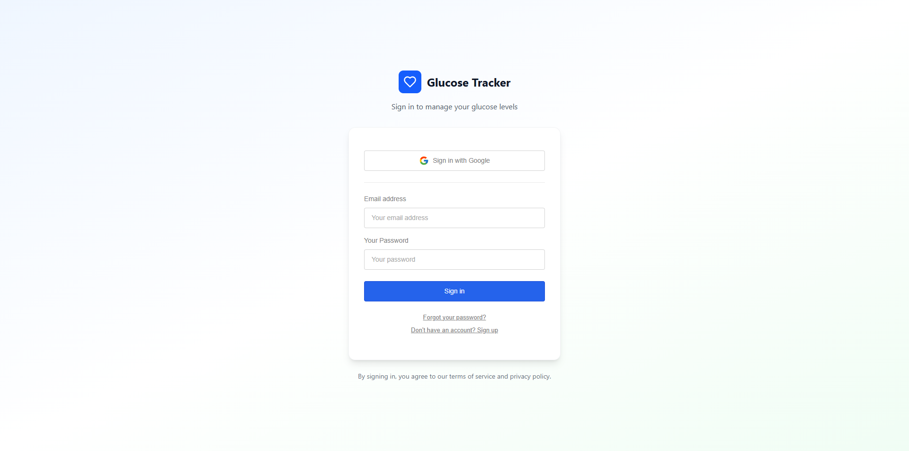
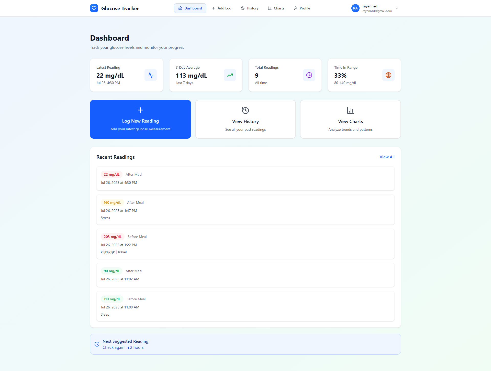
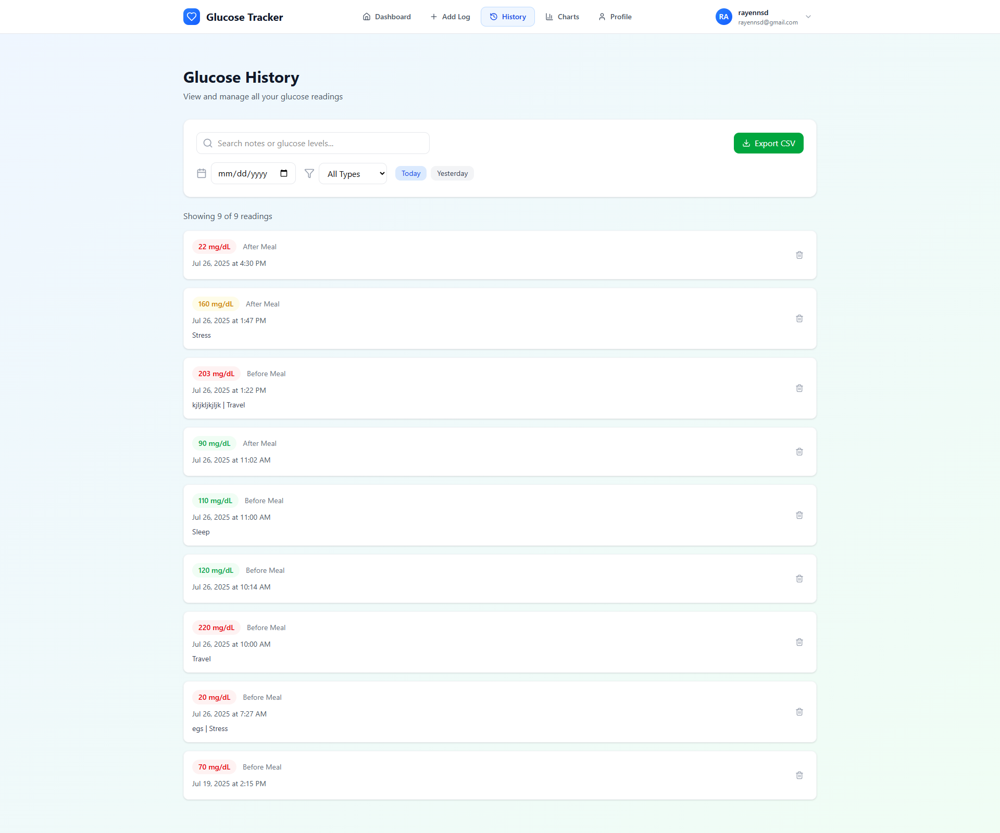
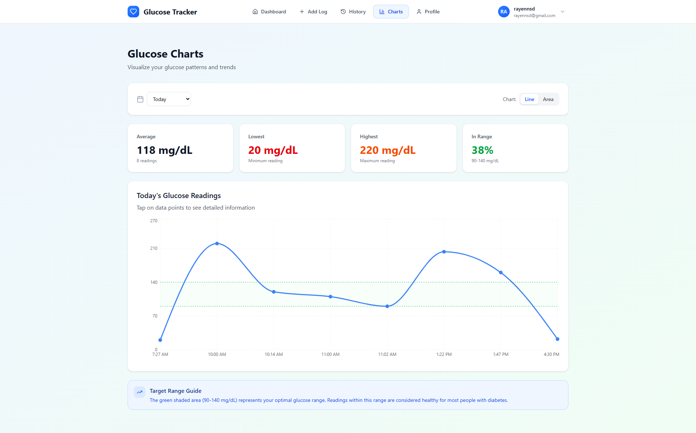
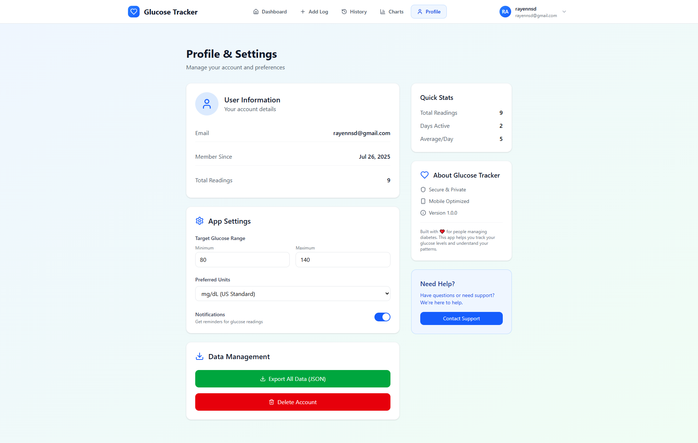

# Glucose Tracker 📊

A modern, mobile-first diabetes management application built with React, TypeScript, and Supabase. Track your glucose levels with beautiful charts, secure authentication, and an intuitive interface.


## ✨ Features

- 📱 **Mobile-First Design** - Optimized for mobile devices with touch-friendly interactions
- 📊 **Interactive Charts** - Beautiful, responsive charts for data visualization
- 🔐 **Secure Authentication** - Google OAuth and email/password with Supabase
- 📈 **Real-time Data** - Live glucose tracking and statistics
- 🎨 **Modern UI/UX** - Clean, professional design with smooth animations
- 📱 **Responsive Navigation** - Adaptive navigation for desktop and mobile

## 🖼️ Screenshots

### Landing Page


### Authentication



### Dashboard



### Add Glucose Log


### History View



### Charts & Analytics



### User Profile



## 🚀 Quick Start

### Prerequisites

- Node.js 18+
- npm or pnpm
- Supabase account

### Installation

1. **Clone and install**

   ```bash
   git clone <your-repo-url>
   cd glucose-tracker
   npm install
   ```

2. **Set up environment variables**
   Create a `.env` file:

   ```env
   VITE_SUPABASE_URL=your_supabase_project_url
   VITE_SUPABASE_ANON_KEY=your_supabase_anon_key
   ```

3. **Run the development server**

   ```bash
   npm run dev
   ```

4. **Open your browser**
   Navigate to `http://localhost:5173`

## 🛠️ Tech Stack

- **Frontend**: React 18, TypeScript, Vite
- **Styling**: Tailwind CSS
- **Backend**: Supabase (Database, Auth, Real-time)
- **Charts**: Recharts
- **Forms**: React Hook Form + Zod validation
- **State Management**: React Query
- **Icons**: Lucide React

## 📦 Available Scripts

- `npm run dev` - Start development server
- `npm run build` - Build for production
- `npm run preview` - Preview production build
- `npm run lint` - Run ESLint

## 🌐 Live Demo

Visit the live application: **[Glucose Tracker](https://glucose-tracker.vercel.app)**

## 📱 Features Overview

### 🔐 Authentication

- Google OAuth integration
- Email/password authentication
- Secure session management
- User profile management

### 📊 Data Management

- Add glucose readings with notes
- Track meal times and types
- View historical data
- Export and analyze trends

### 📈 Analytics

- Interactive charts and graphs
- Statistical insights
- Trend analysis
- Custom date ranges

### 🎨 User Experience

- Responsive design
- Dark/light mode support
- Touch-friendly interface
- Smooth animations

## 🤝 Contributing

1. Fork the repository
2. Create a feature branch
3. Make your changes
4. Submit a pull request

## 📄 License

MIT License - see LICENSE file for details

---

**Built with ❤️ using React, TypeScript, and Supabase**
